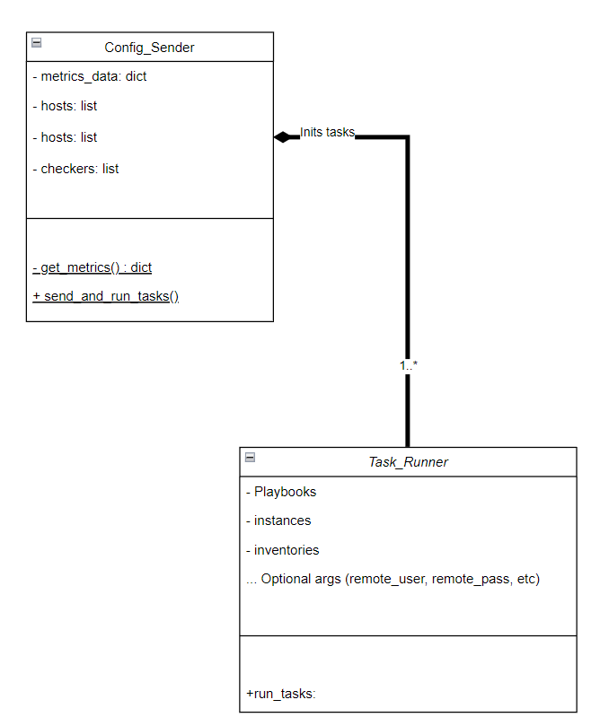

# class diagram

I think, that the core part of my cli app is the Task_Runner class. Due to the minimalistic design of the class the diagram is small, so i got the following:

Here i defined the Config_Sender class. It's responsible for collecting the data and creating the inventories/roles before sending and running them with the Task_Runner class. 
Function **get_metrics()** will make a web request to the internal server to get all the required info and store the recieved data to use it with **send_and_run_tasks()** function which will use the Task_Runner class for starting the required tasks.

