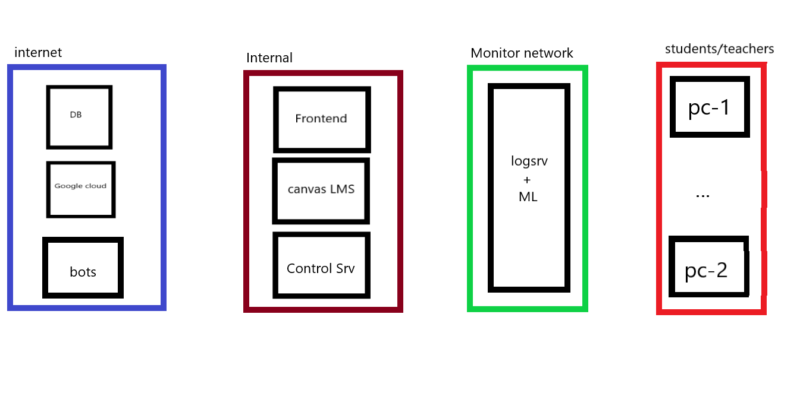

# Networks

Here is a simplified overview of a KTH network for Ethical hacking Course:

**DB** - Database, containing important data such as: vulns, themes, checkers, etc.

**Google cloud** - google cloud.

**Bots** - Server(s) used for automating tasks like: searching for leaks of courses, automatic Slack/StackOverflow replying.

**Frontend** - used to display the visualisation of the current course and it's progress. This server fetches it's data from **Control Srv**.

**Canvas LMS** - Canvas lms.

**Control Srv** - Aggregates and processes all the data from different sources of information and shares it with the **frontend** server.

**Logsrv + ml** - Log server is located in a special monitoring network, used for gathering all sorts of data and sending it for the further processing to the **Control Srv**.

